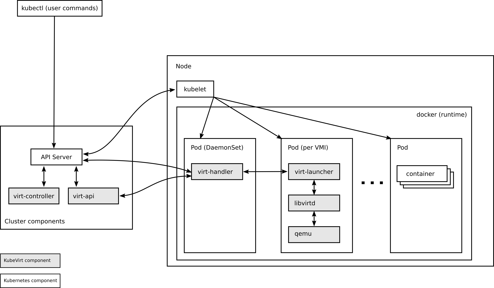
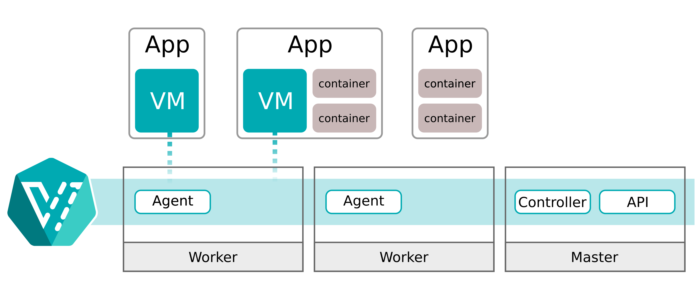
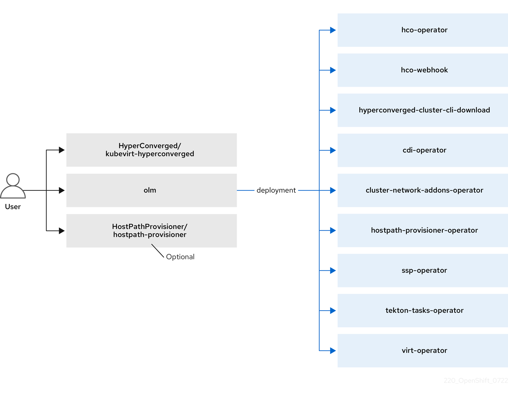

## Brief

### OKD 

let's talk about OKD in a simple way. Think of it as a cool platform for building and running apps in containers. Whether you're dealing with just a handful of machines or a massive data center, OKD has your back. It's built on top of Kubernetes, the powerhouse behind stuff like streaming, ecommerce, holding, gaming, and online banking.

The best part? You can use it with Red Hat's open technologies to take your apps beyond one cloud – use 'em on your own servers or in different cloud setups. Flexibility at its finest!"

here is for the layer 


### OKD Virtualization 

Now we break down OKD Virtualization. It's like an extra feature or add-on for OKD that lets you handle both virtual machines (VMs) and containers together.

With OKD Virtualization, you get new tools in your OKD cluster, thanks to Kubernetes magic. Here's what you can do:

- Create and take care of Linux and Windows virtual machines.
- Run pod and VM tasks side by side in your cluster.
- Connect to your VMs using different tools and consoles.
- Bring in existing VMs or make copies of them.
- Handle stuff like network controllers and storage disks for your VMs.
- Move your VMs around between nodes easily.

> Plus, there's a slick web console to help you manage all these virtual goodies right alongside your OKD containers. It plays nicely with Red Hat OpenShift Data Foundation features too!"

Alright, let's next talk about engine behind it. The hyperconverged-cluster-operator (Kubevirt), or HCO for short, is like a control center for various other operators in Kubernetes, such as kubevirt, cdi, and networking. It's kind of like an operator for operators – a one-stop-shop for deploying and configuring them.

HCO doesn't replace or mess with OLM (Operator Lifecycle Manager). Instead, it helps you create operator Custom Resources (CRs) as you see fit.

So, let's dive into how you can use HCO through a Custom Resource Definition (CRD) method. It's a straightforward way to make the most of this feature. Let's roll!"

Here for the OKD Virtulization Architecture

kubevirt




HCO


Requiremnets,

A few requirements need to be met before you can begin:

- You'll need an OKD cluster or something like OpenShift, you can follow this guide to deploy okd simple way https://ammarun.my.id/ngoprek/server/cloud/openshift/container/Setup-Openshift-Codeready or on prod recommend you can see here too https://ammarun.my.id/ngoprek/server/cloud/kubernetes/openshift/deploy-openshift-cluster/ 
- Don't forget to have the kubectl/oc client utility ready to roll.

## Deploy KubeVirt HyperConverged Cluster Operator from the OperatorHub

Go to OperatorHub > Search KubeVirt > and select Kubevirt hyco cluster operator 


Create CR to trigger HCO 


After few minutes..


ok now we create vm with okd virtualization 

first create namespace for our workspace vms and go to catalog 
oh look we've catalog VMs with datasource(datavolume) ready it, so now we can run vms more easy ~
> DataSource/DataVolume objects are custom resources that are provided by the Containerized Data Importer (CDI) project. Data volumes orchestrate import, clone, and upload operations that are associated with an underlying persistent volume claim (PVC). Data volumes are integrated with OpenShift Virtualization, and they prevent a virtual machine from being started before the PVC has been prepared.

```
oc create ns ammarun

# switch project/namespace

oc projects ammarun
```

Go to dashboard 
Select Fedora catalog > then fill the things here 


you can customize spesification of vms, storage etc 


after reviewing, `CreateVirtualmachine`

On the storage side


And here our nice VM is ready to goo ~


## Reference

-   [OKD Docs](https://docs.okd.io/4.13/virt/about-virt.html)
